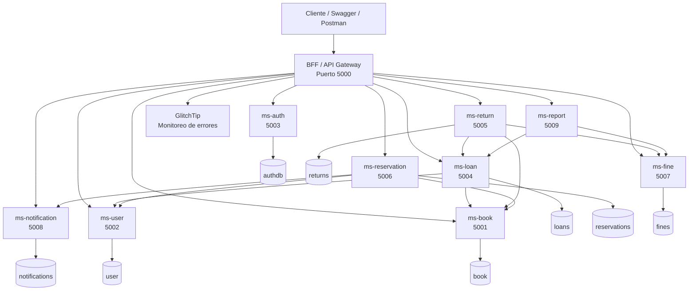
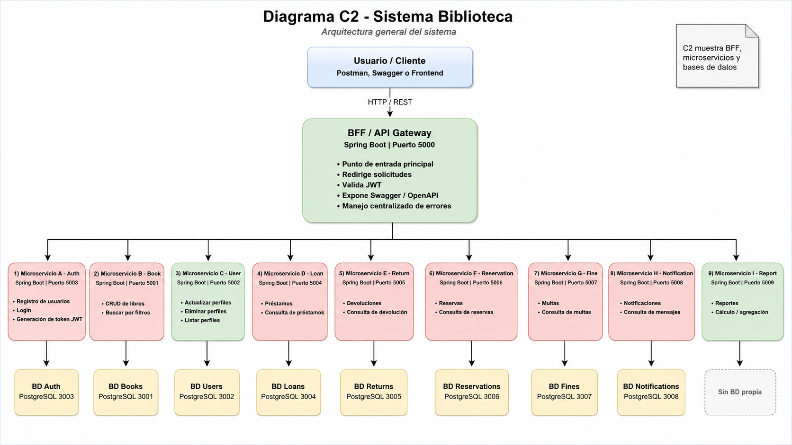
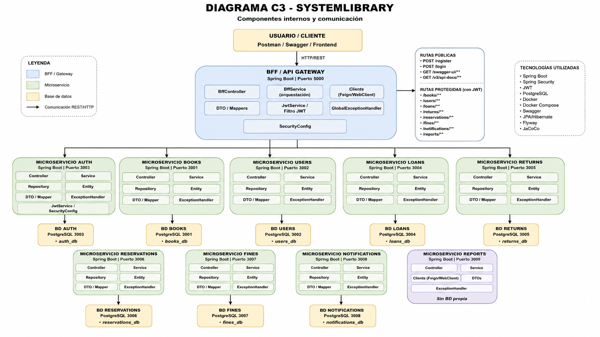

# Library Microservices

Sistema de gestión de biblioteca desarrollado con **arquitectura de microservicios**, utilizando **Java 25**, **Spring Boot**, **PostgreSQL**, **JWT**, **Docker Compose**, **JaCoCo** y monitoreo de errores mediante **GlitchTip**.

El proyecto está compuesto por **1 BFF/API Gateway**, **9 microservicios** y **8 bases de datos PostgreSQL independientes**, respetando el patrón **Database per Service** cuando corresponde.

---

## Contenido

- [Descripción general](#descripción-general)
- [Arquitectura](#arquitectura)
- [Tecnologías](#tecnologías)
- [Servicios y puertos](#servicios-y-puertos)
- [Bases de datos](#bases-de-datos)
- [Responsabilidad de los módulos](#responsabilidad-de-los-módulos)
- [Comunicación entre microservicios](#comunicación-entre-microservicios)
- [Seguridad y sesión de usuario](#seguridad-y-sesión-de-usuario)
- [Endpoints principales del BFF](#endpoints-principales-del-bff)
- [Docker Compose](#docker-compose)
- [Variables de entorno](#variables-de-entorno)
- [Logs y monitoreo con GlitchTip](#logs-y-monitoreo-con-glitchtip)
- [Pruebas y cobertura](#pruebas-y-cobertura)
- [Manejo de errores](#manejo-de-errores)
- [Migraciones](#migraciones)
- [Diagramas C2 y C3](#diagramas-c2-y-c3)
- [Estructura del repositorio](#estructura-del-repositorio)
- [Flujo de Git](#flujo-de-git)
- [Prueba recomendada para la defensa](#prueba-recomendada-para-la-defensa)
- [Integrantes](#integrantes)

---

## Descripción general

**Library Microservices** permite administrar el flujo principal de una biblioteca:

- Registro e inicio de sesión.
- Generación y validación de tokens JWT.
- Gestión de perfiles de usuario.
- CRUD completo de libros.
- Disponibilidad de libros.
- Creación y consulta de préstamos.
- Registro de devoluciones.
- Generación de multas.
- Creación de reservas.
- Envío y consulta de notificaciones.
- Generación de reportes generales.
- Dashboard compuesto con información de distintos microservicios.
- Consulta de la sesión autenticada.
- Registro de logs en consola.
- Monitoreo de errores mediante GlitchTip.

El cliente consume el sistema principalmente a través del **BFF**, que cumple el rol de **API Gateway y fachada**. El BFF valida la sesión, centraliza las rutas públicas y protegidas, consume los microservicios internos y puede combinar sus respuestas.

---

## Arquitectura



### Principios aplicados

- Separación de responsabilidades.
- Arquitectura por capas.
- Patrón Controller-Service-Repository.
- Database per Service.
- Comunicación HTTP entre microservicios.
- BFF como punto de entrada principal.
- Autenticación stateless con JWT.
- Excepciones personalizadas.
- Manejo centralizado de errores.
- Compensación básica cuando una operación distribuida falla.
- Configuración mediante variables de entorno.
- Contenedores independientes por servicio.

---

## Tecnologías

| Tecnología | Uso |
|---|---|
| Java 25 | Lenguaje principal |
| Spring Boot | Desarrollo de los servicios |
| Spring Web | APIs REST |
| Spring Security | Seguridad del BFF |
| Spring Data JPA | Persistencia |
| PostgreSQL 17 | Bases de datos |
| H2 | Base de datos para pruebas |
| Flyway | Migraciones |
| Gradle | Gestión de dependencias y compilación |
| JWT | Autenticación y autorización |
| Swagger / OpenAPI | Documentación y prueba de endpoints |
| JUnit 5 | Pruebas automatizadas |
| Mockito | Simulación de dependencias |
| JaCoCo | Cobertura de código |
| Docker | Contenedores |
| Docker Compose | Orquestación |
| SLF4J | Logs de aplicación |
| GlitchTip | Monitoreo centralizado de errores |
| SDK compatible con Sentry | Envío de eventos hacia GlitchTip |

---

## Servicios y puertos

| Servicio | Responsabilidad principal | Puerto |
|---|---|---:|
| `bff` | API Gateway, seguridad, sesión, agregación y enrutamiento | `5000` |
| `ms-book` | Gestión de libros y disponibilidad | `5001` |
| `ms-user` | Gestión de perfiles de usuario | `5002` |
| `ms-auth` | Registro, login y generación de JWT | `5003` |
| `ms-loan` | Gestión de préstamos | `5004` |
| `ms-return` | Gestión de devoluciones | `5005` |
| `ms-reservation` | Gestión de reservas | `5006` |
| `ms-fine` | Gestión de multas | `5007` |
| `ms-notification` | Gestión de notificaciones | `5008` |
| `ms-report` | Reportes construidos con datos de otros servicios | `5009` |

---

## Bases de datos

Cada microservicio que necesita persistencia utiliza su propia base PostgreSQL.

| Base de datos | Servicio propietario | Puerto local |
|---|---|---:|
| `book` | `ms-book` | `3001` |
| `user` | `ms-user` | `3002` |
| `authdb` | `ms-auth` | `3003` |
| `loans` | `ms-loan` | `3004` |
| `returns` | `ms-return` | `3005` |
| `reservations` | `ms-reservation` | `3006` |
| `fines` | `ms-fine` | `3007` |
| `notifications` | `ms-notification` | `3008` |

`ms-report` no utiliza una base de datos propia. Consulta información desde otros microservicios y procesa los datos requeridos para generar sus reportes.

---

## Responsabilidad de los módulos

### BFF

Es la entrada principal del sistema.

Responsabilidades:

- Funcionar como API Gateway y fachada.
- Exponer las rutas consumidas por el cliente.
- Validar tokens JWT.
- Consultar la sesión autenticada.
- Consumir los nueve microservicios.
- Propagar códigos HTTP y respuestas.
- Combinar información para el dashboard.
- Centralizar Swagger.
- Manejar errores de comunicación.
- Registrar errores en consola.
- Enviar errores inesperados a GlitchTip.

URL principal:

```text
http://localhost:5000
```

### ms-auth

- Registra usuarios.
- Valida credenciales.
- Inicia sesión.
- Genera tokens JWT.
- Mantiene su propia base de autenticación.

### ms-book

- Crea libros.
- Lista libros.
- Busca libros por ID y filtros.
- Actualiza libros.
- Elimina libros.
- Administra la disponibilidad utilizada por préstamos y devoluciones.

### ms-user

- Lista perfiles.
- Crea o actualiza perfiles.
- Relaciona el perfil con el correo de autenticación.
- Elimina perfiles.
- Expone información utilizada por préstamos y reservas.

### ms-loan

- Crea préstamos.
- Consulta préstamos por ID.
- Consulta préstamos por usuario.
- Valida que el usuario exista.
- Valida que el libro exista y esté disponible.
- Evita préstamos activos duplicados para el mismo libro.
- Cambia la disponibilidad del libro.
- Aplica compensación si falla la actualización del libro.

### ms-return

- Registra devoluciones.
- Consulta préstamos.
- Actualiza la disponibilidad del libro.
- Coordina la generación de multas cuando corresponde.
- Consulta devoluciones mediante el ID del préstamo.

### ms-reservation

- Crea reservas.
- Consulta reservas.
- Valida usuarios y libros.
- Se comunica con notificaciones.
- Maneja reglas asociadas al estado de disponibilidad.

### ms-fine

- Registra multas.
- Consulta multas por ID y usuario.
- Marca multas como pagadas.
- Entrega conteos para reportes y dashboard.

### ms-notification

- Crea notificaciones.
- Consulta notificaciones por ID y usuario.
- Marca notificaciones como leídas.
- Entrega conteos para dashboard.

### ms-report

- No mantiene una base de datos propia.
- Consulta información de préstamos y multas.
- Genera un resumen general.
- Demuestra un microservicio de procesamiento sin persistencia.

---

## Comunicación entre microservicios

| Origen | Destino | Motivo |
|---|---|---|
| `bff` | Todos los MS | Enrutamiento, seguridad y agregación |
| `ms-loan` | `ms-user` | Validar usuario |
| `ms-loan` | `ms-book` | Validar libro y actualizar disponibilidad |
| `ms-return` | `ms-loan` | Consultar y actualizar préstamo |
| `ms-return` | `ms-book` | Liberar libro devuelto |
| `ms-return` | `ms-fine` | Crear multa por atraso |
| `ms-reservation` | `ms-user` | Validar usuario |
| `ms-reservation` | `ms-book` | Validar libro |
| `ms-reservation` | `ms-notification` | Crear notificación |
| `ms-report` | `ms-loan` | Obtener datos de préstamos |
| `ms-report` | `ms-fine` | Obtener datos de multas |

Las URLs internas se configuran mediante variables de entorno dentro de `docker-compose.yml`. En Docker, los servicios se comunican utilizando el nombre del servicio, por ejemplo:

```text
http://ms-book:5001
http://ms-user:5002
http://ms-loan:5004
```

---

## Seguridad y sesión de usuario

El sistema utiliza autenticación mediante **JWT Bearer Token**.

### Endpoints públicos

```http
POST /register
POST /login
```

Swagger y la especificación OpenAPI también se encuentran habilitados para facilitar la prueba del sistema.

### Endpoints protegidos

Los endpoints de negocio requieren:

```http
Authorization: Bearer <token>
```

### Flujo de autenticación

1. Registrar un usuario mediante `POST /register`.
2. Iniciar sesión mediante `POST /login`.
3. Copiar el token JWT.
4. Presionar **Authorize** en Swagger.
5. Pegar el token.
6. Consumir los endpoints protegidos.

### Sesión actual

```http
GET /session
```

Este endpoint obtiene el correo del usuario autenticado desde el JWT y confirma que la sesión es válida.

---

## Endpoints principales del BFF

La documentación completa se encuentra en Swagger.

### Autenticación

```http
POST /register
POST /login
GET  /session
```

### Libros

```http
GET    /books
POST   /books
GET    /books/{id}
PUT    /books/{id}
DELETE /books/{id}
GET    /books/search
```

### Usuarios

```http
GET    /users
PUT    /users/profile
DELETE /users/{id}
```

### Préstamos

```http
POST /loans
GET  /loans/{loanId}
GET  /loans/user/{userId}
```

También se exponen operaciones de conteo utilizadas por reportes y dashboard.

### Devoluciones

```http
POST /returns
GET  /returns/loan/{loanId}
```

### Reservas

```http
POST /reservations
```

El controlador también expone consultas relacionadas con reservas y usuarios.

### Multas

```http
GET   /fines/{fineId}
GET   /fines/user/{userId}
PATCH /fines/{fineId}/pay
GET   /fines/count
```

### Notificaciones

```http
GET   /notifications/{notificationId}
GET   /notifications/user/{userId}
PATCH /notifications/{notificationId}/read
```

### Reportes

```http
GET /reports/general-summary
```

### Dashboard

```http
GET /dashboard/user/{userId}
```

Combina información del usuario, préstamos, reservas, multas y notificaciones.

### Prueba de GlitchTip

```http
GET /test/glitchtip
```

Genera intencionalmente un error `500` para verificar:

- Log en consola.
- Manejo centralizado.
- Envío del evento a GlitchTip.

> Este endpoint es únicamente para desarrollo, demostración y defensa académica.

---

## Swagger / OpenAPI

Swagger del BFF:

```text
http://localhost:5000/swagger-ui/index.html
```

Especificación OpenAPI:

```text
http://localhost:5000/v3/api-docs
```

---

## Docker Compose

El archivo `docker-compose.yml` levanta:

- 8 bases de datos PostgreSQL.
- 9 microservicios.
- 1 BFF.
- 18 contenedores en total.
- 1 red interna de Docker.
- Volúmenes persistentes para las bases de datos.

### Requisitos

- Docker Desktop.
- Docker Engine en ejecución.
- Contexto `desktop-linux` en Windows.
- Puertos `3001-3008` y `5000-5009` disponibles.

### Validar la configuración

```bash
docker compose config
```

### Construir y levantar el sistema

```bash
docker compose up -d --build
```

### Revisar el estado

```bash
docker compose ps
```

Las bases de datos deben aparecer como:

```text
Up (healthy)
```

Los microservicios y el BFF deben aparecer como:

```text
Up
```

### Revisar logs

Todos los servicios:

```bash
docker compose logs
```

BFF en tiempo real:

```bash
docker compose logs -f bff
```

Últimas líneas del BFF:

```bash
docker compose logs --tail=150 bff
```

### Detener el sistema

Conservar datos:

```bash
docker compose down
```

Eliminar también los volúmenes:

```bash
docker compose down -v
```

> `docker compose down -v` elimina los datos almacenados en las bases PostgreSQL.

---

## Variables de entorno

El repositorio contiene un archivo seguro de ejemplo:

```text
.env.example
```

Crea el archivo local `.env` antes de iniciar Docker.

### Windows CMD

```cmd
copy .env.example .env
```

### Linux / macOS

```bash
cp .env.example .env
```

Configuración utilizada para GlitchTip:

```env
SENTRY_ENABLED=true
SENTRY_DSN=COLOCAR_DSN_DE_GLITCHTIP
SENTRY_ENVIRONMENT=examen-docker
SENTRY_RELEASE=library-microservices-bff@1.0.0
SENTRY_DEBUG=false
```

El archivo `.env` contiene información privada y no debe subirse a GitHub. Debe permanecer incluido en `.gitignore`.

Comprobación:

```bash
git check-ignore .env
```

Resultado esperado:

```text
.env
```

---

## Logs y monitoreo con GlitchTip

El BFF utiliza SLF4J para mostrar logs en consola y un SDK compatible con Sentry para enviar errores a GlitchTip.

### Comportamiento

- Los eventos informativos se registran con `log.info`.
- Los errores controlados se registran con `log.warn`.
- Los errores inesperados se registran con `log.error`.
- Los errores internos son capturados por `GlobalExceptionHandler`.
- Los errores inesperados se envían a GlitchTip con su stack trace.
- El cliente recibe una respuesta segura sin detalles internos.

Ejemplo de respuesta:

```json
{
  "success": false,
  "data": null,
  "message": "Ocurrió un error interno en el servidor"
}
```

### Probar la integración

1. Obtener un JWT válido.
2. Ejecutar:

```bash
curl -i http://localhost:5000/test/glitchtip \
  -H "Authorization: Bearer TOKEN_JWT"
```

En Windows CMD:

```cmd
curl -i http://localhost:5000/test/glitchtip ^
-H "Authorization: Bearer TOKEN_JWT"
```

Resultado esperado:

```text
HTTP/1.1 500
```

Revisar consola:

```bash
docker compose logs --tail=150 bff
```

El evento esperado en GlitchTip es:

```text
IllegalStateException
Error de prueba controlado desde Eva-3-Library BFF
```

---

## Pruebas y cobertura

El proyecto utiliza:

- JUnit 5.
- Mockito.
- Spring Boot Test.
- H2.
- JaCoCo.

Los tests validan:

- Controladores.
- Servicios.
- Repositorios.
- DTOs.
- Validaciones.
- Reglas de negocio.
- Respuestas HTTP.
- Persistencia con H2.
- Comunicación simulada entre servicios.
- Manejo de errores.
- Endpoint de prueba de GlitchTip.

### Ejecutar pruebas de un módulo

Windows:

```cmd
cd bff
gradlew.bat clean test
```

Linux / macOS:

```bash
cd bff
./gradlew clean test
```

Reemplaza `bff` por el módulo correspondiente.

### Generar cobertura

Windows:

```cmd
gradlew.bat clean test jacocoTestReport
```

Linux / macOS:

```bash
./gradlew clean test jacocoTestReport
```

### Reportes

Reporte de tests:

```text
build/reports/tests/test/index.html
```

Reporte HTML de JaCoCo:

```text
build/reports/jacoco/test/html/index.html
```

Reporte XML de JaCoCo:

```text
build/reports/jacoco/test/jacocoTestReport.xml
```

El requisito académico es mantener una cobertura mínima de **40 %**. La cobertura debe verificarse en cada módulo antes de generar la versión final de entrega.

Documentos adicionales:

```text
GUIA_TESTING.md
TESTS_QUICK_START.md
```

---

## Manejo de errores

Los servicios implementan manejo centralizado mediante clases `GlobalExceptionHandler` y excepciones personalizadas.

Ejemplos de reglas:

- Usuario inexistente.
- Libro inexistente.
- Libro no disponible.
- Préstamo activo duplicado.
- Recurso eliminado.
- Multa inexistente.
- Error al comunicarse con otro microservicio.
- Error interno inesperado.

### Códigos HTTP principales

| Código | Significado |
|---:|---|
| `200` | Operación exitosa |
| `201` | Recurso creado |
| `400` | Solicitud o regla de negocio inválida |
| `401` | JWT ausente o inválido |
| `404` | Recurso no encontrado |
| `409` | Conflicto de negocio, cuando corresponda |
| `500` | Error interno inesperado |

Los errores inesperados del BFF se muestran en Docker y se envían a GlitchTip.

---

## Migraciones

Los servicios con persistencia utilizan Flyway.

Ruta habitual:

```text
src/main/resources/db/migration
```

Durante el inicio:

1. Flyway revisa el historial.
2. Ejecuta las migraciones pendientes.
3. Se crea o actualiza el esquema.
4. Hibernate valida la relación entre entidades y tablas.

---

## Diagramas C2 y C3

### Diagrama C2

Muestra las piezas principales del sistema, el BFF, los microservicios y las bases de datos.



### Diagrama C3

Muestra la estructura interna de los microservicios y sus capas.



---

## Estructura del repositorio

```text
Library-Microservices/
├── bff/
├── ms-auth/
├── ms-book/
├── ms-user/
├── ms-loan/
├── ms-return/
├── ms-reservation/
├── ms-fine/
├── ms-notification/
├── ms-report/
├── docs/
│   ├── c2.png
│   └── C3.png
├── .env.example
├── .gitignore
├── docker-compose.yml
├── GUIA_TESTING.md
├── TESTS_QUICK_START.md
├── PLAN_AUTH.md
└── README.md
```

Los microservicios con persistencia mantienen una estructura similar:

```text
controller/
service/
repository/
entity/
dto/
exception/
config/
```

El BFF mantiene una estructura similar:

```text
controller/
services/
client/
dto/
exception/
config/
security/
```

---

## Flujo de Git

El proyecto utiliza ramas para separar integración y desarrollo:

```text
main
develop
feature/integracion-microservicios
```

Flujo recomendado:

```text
feature/* → develop → main
```

Comandos habituales:

```bash
git status
git add .
git commit -m "descripción del cambio"
git push origin feature/integracion-microservicios
```

Antes de entregar:

1. Confirmar que los tests pasen.
2. Confirmar la cobertura.
3. Confirmar que Docker levante los 18 contenedores.
4. Revisar que `.env` no esté versionado.
5. Integrar la rama de trabajo.
6. Descargar el ZIP desde la versión final de `main`.

---

## Prueba recomendada para la defensa

1. Levantar el sistema:

```bash
docker compose up -d --build
```

2. Confirmar contenedores:

```bash
docker compose ps
```

3. Abrir Swagger:

```text
http://localhost:5000/swagger-ui/index.html
```

4. Registrar un usuario con `POST /register`.
5. Iniciar sesión con `POST /login`.
6. Autorizar Swagger con el JWT.
7. Consultar `GET /session`.
8. Ejecutar el CRUD completo de libros.
9. Crear un préstamo.
10. Confirmar que el libro quede no disponible.
11. Registrar una devolución.
12. Verificar que el libro vuelva a estar disponible.
13. Generar o consultar una multa.
14. Crear una reserva.
15. Consultar notificaciones.
16. Consultar `GET /reports/general-summary`.
17. Consultar `GET /dashboard/user/{userId}`.
18. Provocar un error con `GET /test/glitchtip`.
19. Mostrar el error en los logs de Docker.
20. Mostrar el evento recibido en GlitchTip.
21. Abrir el reporte de JaCoCo.

---

## Evidencias recomendadas

- `docker compose config` sin errores.
- `docker compose up -d --build`.
- `docker compose ps` con los 18 contenedores.
- Bases PostgreSQL en estado `healthy`.
- Swagger del BFF.
- Registro e inicio de sesión.
- Token JWT y botón **Authorize**.
- Endpoint `GET /session`.
- CRUD completo.
- Comunicación entre microservicios.
- Manejo centralizado de errores.
- Error `404` controlado.
- Error `500` de prueba.
- Stack trace en Docker.
- Evento visible en GlitchTip.
- Reportes de tests.
- Reportes de cobertura JaCoCo.
- Diagramas C2 y C3.
- Historial de commits y ramas.

---

## Integrantes

- **Ignacio Moya**
- **Bryan Burgos**

---

## Conclusión

Library Microservices implementa una solución distribuida para la gestión de una biblioteca, separando cada responsabilidad en servicios independientes.

El proyecto incorpora:

- 1 BFF/API Gateway.
- 9 microservicios.
- 8 bases PostgreSQL independientes.
- Database per Service.
- CRUD completo.
- Comunicación entre servicios.
- JWT y sesión de usuario.
- Swagger/OpenAPI.
- Manejo centralizado de errores.
- Excepciones personalizadas.
- Logs en consola.
- Monitoreo con GlitchTip.
- Pruebas automatizadas.
- Cobertura con JaCoCo.
- Migraciones con Flyway.
- Docker y Docker Compose.
- Diagramas C2 y C3.
- Uso de ramas Git.

Este repositorio corresponde a un proyecto académico desarrollado para demostrar diseño, implementación, integración, pruebas, seguridad y despliegue de una arquitectura de microservicios.